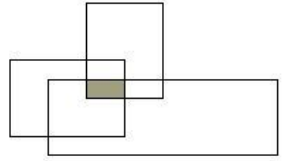
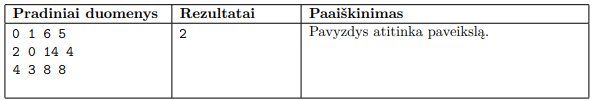

# Trys sodininkai

Trys draugai apsigyvenę kaime nusprendė mokytis sodininkauti. Kaime buvo didžiulis sodas,
jame augo po vieną vaismedį kiekviename kvadratiniame ploto vienete.

Kiekvienas iš trijų draugų pasirinko stačiakampį sklypą ir nusprendė prižiūrėti jame esančius
medžius. Susirinkus draugėn paaiškėjo, kad jų pasirinkti sklypai persidengia, t. y. kai kuriuos
vaismedžius prižiūrės ne vienas, o keletas sodininkų.

## Užduotis
Parašykite algoritmą, kuris suskaičiuotų, kiek vaismedžių panorėjo prižiūrėti visi
trys draugai.

## Pradiniai duomenys
Pradiniai duomenys pateikiami trijose eilutėse. Į kiekvieną eilutę
įrašyta po keturis skaičius, apibūdinančius kiekvieno draugo pasirinktą sklypą: sklypo apatinio kairiojo ir viršutinio dešiniojo kampų koordinatės (pirma koordinatė x, po to – y). Visos
koordinatės sveikieji skaičiai.

## Rezultatai
Rezultatas – vaismedžių, kuriuos nori prižiūrėti visi trys draugai, skaičius.

## Pavyzdžiai
