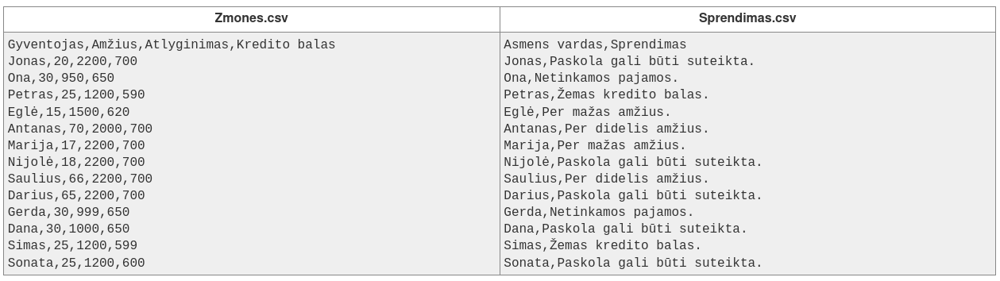

# 8.10 Paskola

## Paskolos išdavimo skaičiavimas
Programuotojui teko užduotis parašyti programą, kuri pagal vartotojo duomenis (amžių, pajamas ir kredito balą) nustatytų, ar vartotojas gali gauti banko paskolą:

- Paskolos išduodamos asmenims tarp 18 ir 65 metų amžiaus (imtinai).
- Paskolos išduodamos asmenims, kurie uždirba nemažiau kaip 1000 eurų.
- Paskolos neišduodamos jeigu asmens kredito balas yra mažesnis nei 600. 

## Duomenys.
Duomenų faile yra pateikiamas sąrašas su asmenų vardais, amžiumi, pajamomis ir kredito balais.

## Rezultatai.
Sąraše reikia pateikti asmens vardą ir sprendimą. Tikrinimas vyksta tokia eilės tvarka: „Per mažas amžius.“, „Per didelis amžius.“, „Netinkamos pajamos.“, „Žemas kredito balas.“, „Paskola gali būti suteikta.“.

