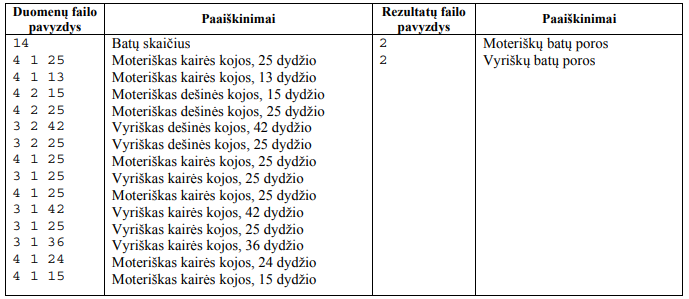

# Batai
Dėžėje yra skirtingo dydžio kairės ir dešinės kojos moteriškų ir vyriškų batų. Porą sudaro to paties
dydžio kairės ir dešinės kojų batai ir, aišku, tik vyriški arba tik moteriški.

Parašykite programą, kuri suskaičiuotų, kiek yra:
- vyriškų batų porų;
- moteriškų batų porų.

## Duomenys

Duomenys yra tekstiniame faile U1.txt:
- Pirmoje eilutėje užrašytas batų skaičius n (1 < n < 100).
- Toliau atskirose eilutėse surašyti duomenys apie kiekvieną batą:
  - pirmas skaičius 3 (vyriškas batas) arba 4 (moteriškas batas);
  - antras skaičius 1 (kairės kojos) arba 2 (dešinės kojos);
  - toliau skaičius, reiškiantis bato dydį m (5 < m < 60)..

## Rezultatai

Rezultatus pateikite tekstiniame faile U1rez.txt:
- pirmoje eilutėje – kiek yra moteriškų batų porų;
-  antroje eilutėje – kiek yra vyriškų batų porų; 
Jei vyriškų ir / arba moteriškų batų porų nėra, tai įrašykite nulį (0).

## Nurodymai
- Programoje naudokite sveikųjų skaičių masyvus.
- Parašykite procedūrą duomenims skaityti.
- Parašykite funkciją, kuri skaičiuotų, kiek yra vyriškų (moteriškų) batų porų.
- Programoje nenaudokite sakinių, skirtų darbui su ekranu. 

