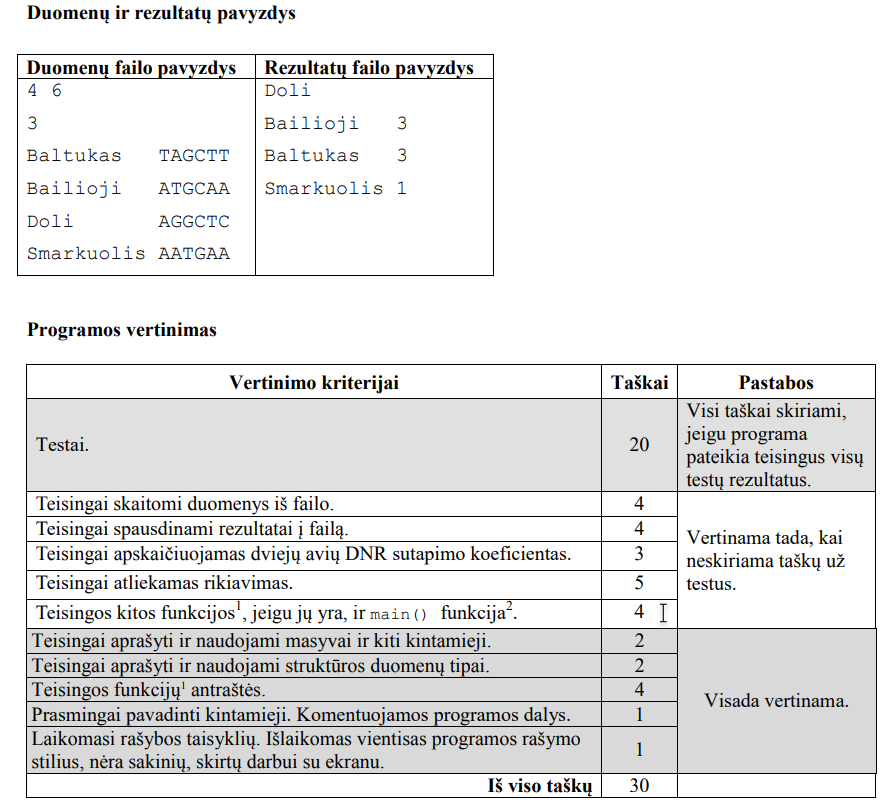

# Avys

DNR molekulėje yra užkoduota genetinė informacija, dalijimosi metu perduodama naujoms ląstelėms.

Siekiant išsiaiškinti avių giminystės ryšius, yra lyginami jų DNR fragmentai.

Parašykite programą, kuri palygintų tiriamą avį su likusiomis avimis:
- nustatykite DNR fragmentų sutapimo koeficientą - kiek sutampa raidėmis A, T, G ir C pažymėtų DNR nukleotidų, esančių tose pačiose pozicijose;
- surikiuokite likusias avis pagal DNR sutapimo koeficientą mažėjimo tvarka (nuo didžiausio iki mažiausio), o jei koeficientai sutampa, – pagal avies vardą abėcėlės tvarka.

## Pradiniai duomenys

Duomenys yra tekstiniame faile U2.txt:
- pirmoje eilutėje yra avių skaičius n (2<=n<=20) ir DNR fragmento ilgis m (4<=m<=20), atskirti vienas nuo kito vienu tarpo simboliu;
- antroje eilutėje – tiriamos avies eilės numeris;
- tolesnėse n eilučių yra šie duomenys, atskirti vienu tarpo simboliu:
  - pirmose 10 pozicijų – avies vardas (pirmoji raidė – didžioji);
  - DNR fragmentas, užkoduotas raidėmis A, T, G ir C.

Visi DNR fragmentai yra skirtingi!

## Rezultatai

Tekstiniame faile U2rez.txt rezultatus pateikite tokia tvarka:
- pirmoje eilutėje – tiriamos avies vardas;
- kiekvienoje naujoje eilutėje – likusių avių duomenys: avies vardas ir DNR sutapimo koeficientas, atskirti vienu tarpo simboliu.

## Nurodymai

- Programoje naudokite struktūros duomenų tipą vienos avies duomenims (vardui, DNR fragmentui ir DNR sutapimo koeficientui) saugoti.
- Programoje naudokite masyvo duomenų tipą avių duomenims saugoti.
- Sukurkite funkciją dviejų avių DNR sutapimo koeficientui apskaičiuoti.
- Sukurkite avių rikiavimo pagal DNR sutapimo koeficientą funkciją.
- Sukurkite funkciją duomenims skaityti ir funkciją rezultatams spausdinti.
- Programoje nenaudokite sakinių, skirtų darbui su ekranu.

