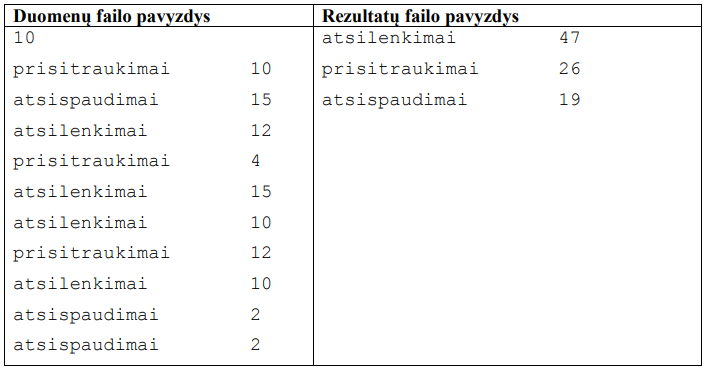
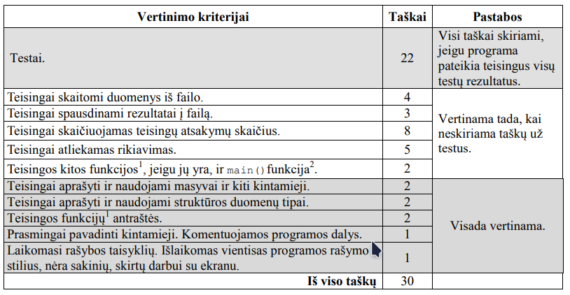

# Mankšta
Vytautas nusprendė vieną vasaros mėnesį mankštintis, atlikdamas keletą nesudėtingų pratimų.
Kaskart pasimankštinęs jis užsirašydavo, kuriuos pratimus ir kiek kartų atliko.

Parašykite programą, kuri nustatytų, kiek iš viso kartų per mėnesį Vytautas atliko kiekvieną pratimą. 

## Pradiniai duomenys
Duomenys pateikiami tekstiniame faile U2.txt.
Pirmoje eilutėje pateikiamas vienas sveikasis skaičius n (1<=n<=100), nurodantis, kiek Vytautas
užsirašė duomenų eilučių.
Tolesnėse n eilučių pateikiami Vytauto užsirašyti duomenys:
- pratimo pavadinimas (20 simbolių) ir vienas tarpo simbolis;
- kiek kartų buvo atliktas šis pratimas.

## Rezultatai

Rezultatus pateikite tekstiniame faile U2rez.txt.
Atskirose eilutėse užrašykite šiuos kiekvieno pratimo duomenis:
- pratimo pavadinimą ir tarpo simbolį;
- kiek iš viso kartų per mėnesį buvo atliktas šis pratimas.
Rezultatus išrikiuokite atlikimo kartų mažėjimo tvarka (jei skaičiai sutampa – pratimų pavadinimų
abėcėlės tvarka).

## Nurodymai
- Programoje naudokite struktūros duomenų tipą Vytauto duomenims saugoti.
- Sukurkite rikiavimo funkciją.
- Programoje nenaudokite sakinių, skirtų darbui su ekranu.

## Duomenų ir rezultatų pavyzdžiai

## Programos vertinimas

