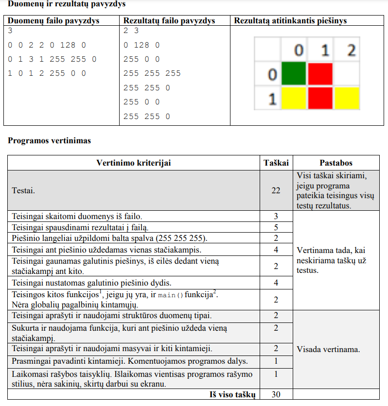

# Piešinys

Spalvotų stačiakampių rinkinys aprašomas nurodant jų spalvą ir
koordinates.

Stačiakampiai koordinačių sistemoje gali vieni kitus dengti.

Sukurkite galutinį piešinį, gaunamą iš eilės dedant vieną stačiakampį ant kito (naujojo stačiakampio spalva pakeičia ankstesnę).
Vaizdo dydis yra 100 × 100 langelių (x ir y koordinatės kinta nuo 0 iki 99). Pradinis piešinys nuspalvintas baltai (RGB kodas – 255 255 255).

Parašykite programą, kuri nustatytų naujojo piešinio langelių spalvas.

Pastaba. RGB – spalvų maišymo sistema, kurioje naudojamos trys bazinės spalvos: raudona (R), žalia (G) ir mėlyna (B).

## Pradiniai duomenys

Duomenys pateikiami tekstiniame faile U2.txt.
Pirmoje eilutėje esantis sveikasis skaičius n (1<=n<=100) nurodo, kiek yra stačiakampių.
Tolesnėse n eilučių pateikiami stačiakampių duomenys:
- pirmi du skaičiai – viršutinio kairiojo kampo koordinatės x, y (0<=x<=99 ir 0<=y<=99);
- du skaičiai – stačiakampio plotis ir ilgis dx, dy (1<=dx<=20 ir 1<=dy<=20, x+dx<=100, y+dy<=100);
- trys skaičiai, nusakantys stačiakampio spalvos RGB komponentes.

## Rezultatai

Rezultatus pateikite tekstiniame faile U2rez.txt.
Į rezultatų failą įrašykite ne visą piešinį, o tik iki paskutinių nuspalvintų stulpelių ir eilučių (atmeskite baltus stulpelius iš dešinės ir baltas eilutes iš apačios).
Rezultatų faile turi būti įrašyta:
- pirmoje eilutėje – galutinio piešinio ilgis a (eilučių skaičius) ir plotis b (stulpelių skaičius);
- kitose a*b eilučių, einant per piešinio langelius iš kairės į dešinę ir iš viršaus į apačią, – po 3 skaičius, nusakančius langelio RGB komponentes.

## Nurodymai

- Sukurkite funkciją, kuri ant piešinio uždeda stačiakampį.
- Programoje naudokite struktūros duomenų tipą stačiakampių duomenims saugoti.
- Programoje nenaudokite sakinių, skirtų darbui su ekranu.
- Programoje nenaudokite globalių pagalbinių kintamųjų.

