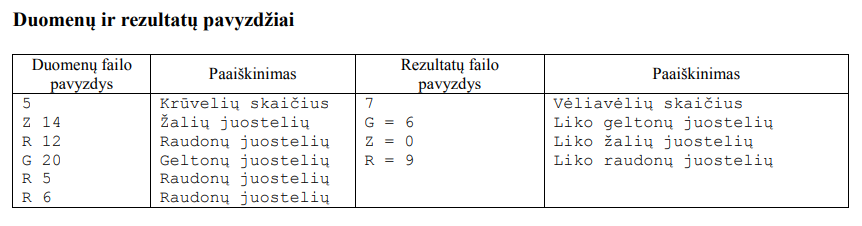
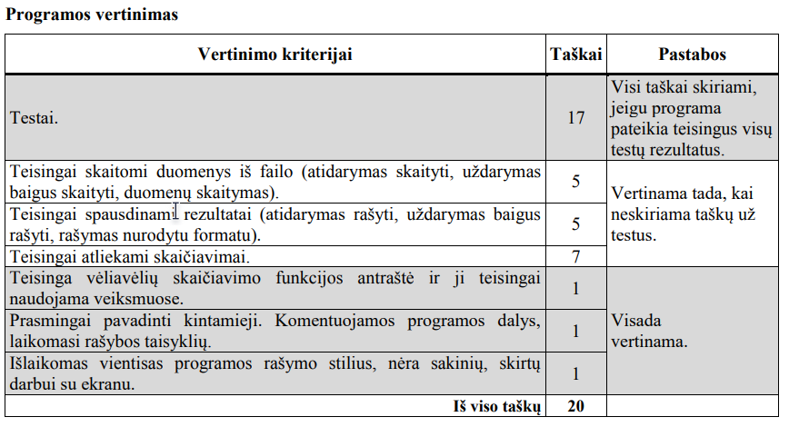

Darželyje vaikai karpė spalvotas juosteles ir kiekvienas dėliojo į savo krūveles pagal spalvas:
geltonas (G), žalias (Z) ir raudonas (R). Kai kurie karpė ne vienos spalvos juosteles. Po to visi vaikai iš
visų juostelių klijavo Lietuvos Respublikos vėliavėles – ant kartono pagrindo iš abiejų pusių priklijavo
atitinkamas juosteles. Taigi vienai vėliavėlei reikėjo dviejų kiekvienos spalvos juostelių. Vaikai karpė
nevienodai stropiai, todėl juostelių galėjo būti skirtingas skaičius.

Parašykite programą, kuri suskaičiuotų:
- kiek buvo suklijuota vėliavėlių, jeigu jų buvo klijuojama tiek, kiek pakako juostelių;
- kiek kokios spalvos juostelių liko nepanaudota.

#### Pradiniai duomenys
Duomenys pateikiami tekstiniame faile U1.txt.

Duomenų faile įrašyta: 
- Pirmoje eilutėje užrašytas juostelių krūvelių skaičius n (1  n  30). 
- Toliau kiekvienoje iš n eilučių pateikta informacija apie sukarpytas juosteles – krūvelės spalva (spalvos kodas: G, Z arba R) ir tos spalvos juostelių skaičius, atskirti vienu tarpo simboliu.

Visi skaičiai yra sveikieji.

#### Rezultatai
Rezultatus pateikite tekstiniame faile U1rez.txt.
- Pirmoje eilutėje įrašykite, kiek buvo suklijuota vėliavėlių.
- Antroje eilutėje įrašykite, kiek liko nepanaudota geltonų juostelių: rašykite spalvos kodą G, lygybės ženklą (=) ir juostelių skaičių; lygybės ženklas iš abiejų pusių turi būti atskirtas vienu tarpo simboliu.
- Trečioje eilutėje tokiu pačiu būdu įrašykite žalių juostelių likutį.
- Ketvirtoje eilutėje – raudonų juostelių likutį.

#### Nurodymai
- Sukurkite ir parašykite funkciją, kuri suskaičiuotų, kiek buvo suklijuota vėliavėlių.
- Programoje nenaudokite sakinių, skirtų darbui su ekranu.

