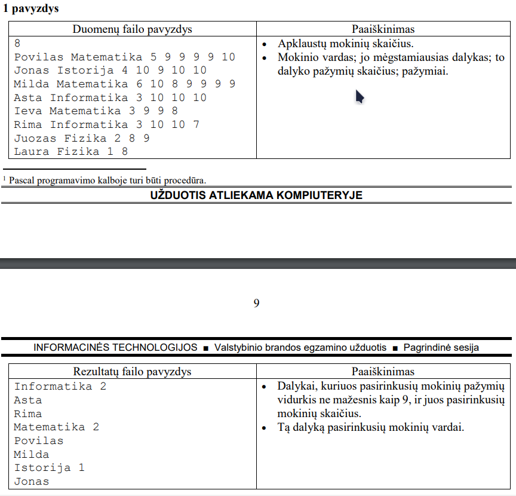
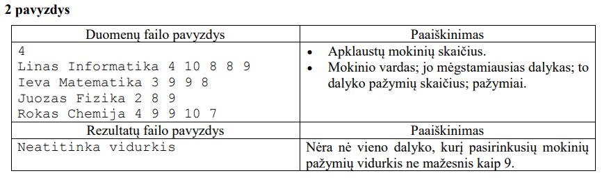
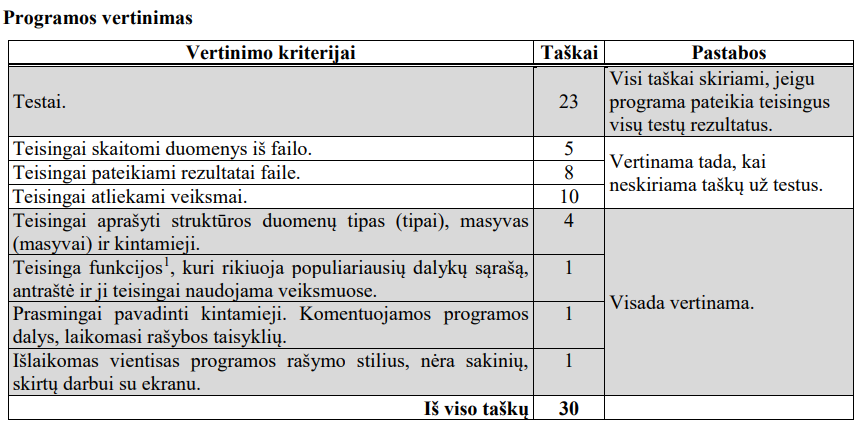

# Apklausa

Monika projektinio darbo metu atliko apklausą, siekdama išsiaiškinti, kurie mokomieji dalykai jos
draugams patinka labiausiai. Atlikdama apklausą, ji kaskart pasižymėdavo draugo vardą, jo mėgstamiausią
dalyką ir to dalyko pažymius.

Parašykite programą, kuri sudarytų mokinių nurodytų populiariausių dalykų sąrašą ir pateiktų šiuos
dalykus pasirinkusių mokinių vardus. Sąraše turi būti pateikiami tik tie dalykai, kuriuos pasirinkusių
mokinių pažymių vidurkis yra ne mažesnis kaip 9.

## Pradiniai duomenys

Duomenys pateikiami tekstiniame faile U2.txt.
- Pirmoje eilutėje užrašytas apklaustų mokinių skaičius m (1 ≤ m ≤ 50).
- Tolesnėse eilutėse užrašyti draugų duomenys: vardas (vienas žodis); jo mėgstamiausias dalykas
(vienas žodis); to dalyko pažymių skaičius; pažymiai. Duomenys atskirti vienu tarpo simboliu.

## Rezultatai

Rezultatus pateikite tekstiniame faile U2rez.txt.
- Įrašykite dalykus, kuriuos pasirinkusių mokinių pažymių vidurkis ne mažesnis kaip 9, ir juos
pasirinkusių mokinių skaičių. Dalykus rašykite pagal jų populiarumą mažėjančiai. Jei yra keli
dalykai, kurių populiarumas vienodas, tai juos pateikite abėcėliškai.
- Po kiekvieno dalyko atskirose eilutėse pateikite jį pasirinkusių mokinių, kurių to dalyko pažymių
vidurkis yra ne mažesnis kaip 9, vardus tokia eilės tvarka, kokia jie buvo užrašyti pradinių duomenų
faile.
- Jeigu tarp dalykų nėra tokių, kuriuos pasirinkusių mokinių pažymių vidurkis ne mažesnis kaip 9,
tuomet turi būti pateiktas tekstinis pranešimas „Neatitinka vidurkis“.

## Nurodymai

- Programoje naudokite struktūros duomenų tipo masyvą apklaustų mokinių duomenims saugoti.
- Sukurkite ir parašykite funkciją, kuri surikiuoja populiariausių dalykų sąrašą.
- Programoje nenaudokite globalių kintamųjų.
- Programoje nenaudokite sakinių, skirtų darbui su ekranu.

## Duomenų ir rezultatų pavyzdžiai

