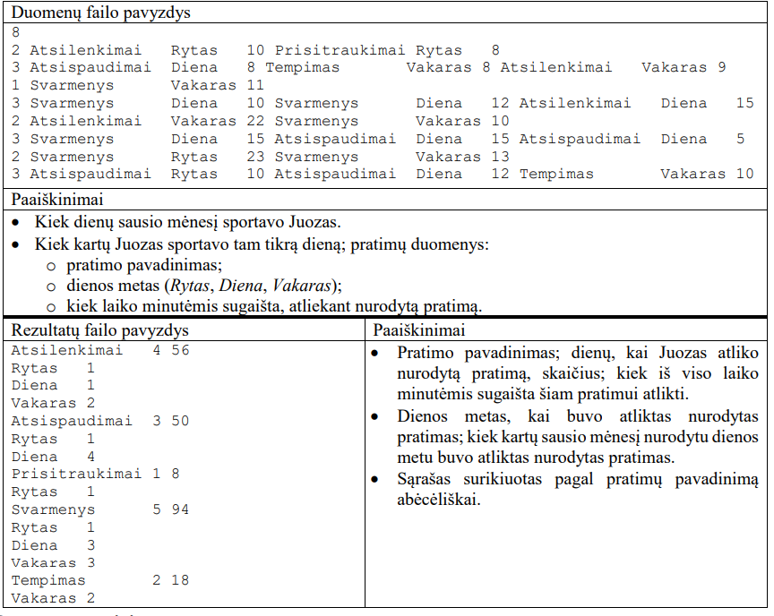
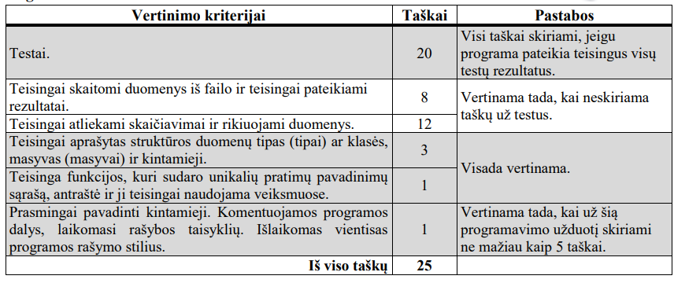

# Sportas namuose

Juozas dirba namuose. Norėdamas daugiau judėti, jis nusprendė sausio mėnesį pradėti sportuoti – pagal galimybes atlikti namuose penkis įvairius pratimus. Juozas užrašuose žymėdavosi sportavimo duomenis: kiek kartų sportavo tam tikrą dieną, pratimų pavadinimus, kuriuo dienos metu juos atliko ir kiek laiko minutėmis skyrė nurodytiems pratimams atlikti.

Parašykite programą, kuri apskaičiuotų ir išvestų Juozo sausio mėnesį atliktų pratimų statistiką

## Pradiniai duomenys

Duomenys pateikiami tekstiniame faile `U2.txt`.

- Pirmoje eilutėje užrašyta, kiek dienų d (1 ≤ d ≤ 31) sausio mėnesį sportavo Juozas.
- Tolesnėse eilutėse užrašyti Juozo sportavimo duomenys: kiek kartų jis sportavo tam tikrą dieną s (1 ≤ s ≤ 7) ir pratimų duomenys: pratimo pavadinimas (14 simbolių), dienos metas (žodis Rytas, Diena, Vakaras; 7 simboliai) ir kiek laiko minutėmis Juozas sugaišo, atlikdamas nurodytą pratimą. Juozas gali tą patį pratimą atlikti tą pačią dieną daugiau negu vieną kartą ir bet kuriuo dienos metu. Duomenys atskirti vienu tarpo simboliu. Buvo bent viena diena, kai Juozas atliko bent vieną pratimą.

## Rezultatai

Rezultatus išvesti į tekstinių failą `U2rez.txt`.

- Įrašykite pratimų pavadinimus, dienų, kai Juozas atliko nurodytus pratimus, skaičių ir kiek iš viso laiko minutėmis sugaišo šiems pratimams atlikti. Pratimų sąrašą surikiuokite abėcėliškai. Duomenis eilutėje atskirkite vienu tarpo simboliu.
- Po kiekvieno pratimo pavadinimo atskirose eilutėse parašykite žodžius Rytas, Diena, Vakaras ir nurodykite, kiek kartų sausio mėnesį Juozas nurodytu dienos metu atliko nurodytą pratimą. Duomenis eilutėje atskirkite vienu tarpo simboliu. Jeigu kurio nors pratimo kuriuo nors dienos metu nebuvo atlikta nė karto, duomenų apie šį dienos metą pateikti nereikia.

## Nurodymai

- Programoje naudokite struktūros duomenų tipo masyvą sportavimo duomenims saugoti.
- Sukurkite ir parašykite funkciją, kuri sudarytų pratimų unikalių (nepasikartojančių) pavadinimų sąrašą.

## Duomenų ir rezultatų pavyzdžiai

## Programos vertinimas

