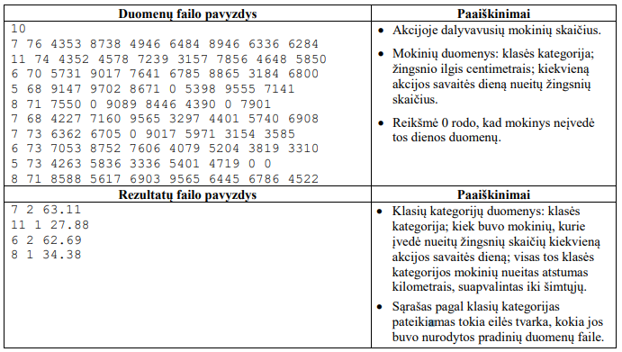

# Žingsniai

Mokykla, minėdama Pasaulinę sveikatos dieną, surengė savaitės trukmės akciją „Judėk!“ Kiekvienas
akcijos dalyvis turėjo užsiregistruoti internetu, nurodydamas savo klasės kategoriją ir žingsnio ilgį, o paskui
kiekvieną savaitės dieną įvesti nueitų žingsnių skaičių.

Parašykite programą, kuri pateiktų kiekvienos klasės kategorijos visų akcijoje dalyvavusių mokinių
nueito atstumo sąrašą

## Pradiniai duomenys
Duomenys pateikti tekstiniame faile U1.txt.
- Pirmoje eilutėje užrašytas akcijoje dalyvavusių mokinių skaičius m (10 ≤ m ≤ 50).
- Tolesnėse eilutėse užrašyti akcijoje dalyvavusių mokinių duomenys: klasės kategorija (skaičius nuo
1 iki 12); žingsnio ilgis centimetrais; kiekvieną akcijos savaitės dieną nueitų žingsnių skaičius. Jeigu
mokinys tam tikrą savaitės dieną neįvedė nueitų žingsnių skaičiaus, pateikiama reikšmė 0. Duomenys
atskirti vienu tarpo simboliu. Buvo bent vienas mokinys, kuris įvedė nueitų žingsnių skaičių kiekvieną
akcijos savaitės dieną.

## Rezultatai
Rezultatus pateikite tekstiniame faile U1rez.txt.
- Spausdinamas kiekvienos klasės kategorijos mokinių viso nueito atstumo sąrašas: klasės kategorija;
kiek buvo mokinių, kurie įvedė nueitų žingsnių skaičių kiekvieną akcijos savaitės dieną; visas
nurodytos klasės kategorijos nueitas atstumas kilometrais, suapvalintas iki šimtųjų. Jeigu dalyvis
bent vieną dieną neįvedė nueitų žingsnių skaičiaus, jo duomenys nėra naudojami skaičiavimams.
Duomenys atskirti vienu tarpo simboliu.
- Vienoje eilutėje pateikiami vienos klasės kategorijos duomenys. Jeigu kurioje nors klasės kategorijoje
nebuvo nė vieno mokinio, kuris įvedė nueitų žingsnių skaičių kiekvieną akcijos savaitės dieną, tai
duomenų apie šią klasės kategoriją pateikti nereikia. Sąrašas pagal klasių kategorijas pateikiamas
tokia eilės tvarka, kokia jos buvo nurodytos pradinių duomenų faile.

## Nurodymai
Sukurkite ir parašykite vieną funkciją, kuri apskaičiuoja kiekvienos klasės kategorijos visą nueitą
atstumą kilometrais ir suskaičiuoja, kiek tos klasės kategorijos mokinių įvedė nueitų žingsnių skaičių
kiekvieną akcijos savaitės dieną.

## Duomenų ir rezultatų pavyzdys
