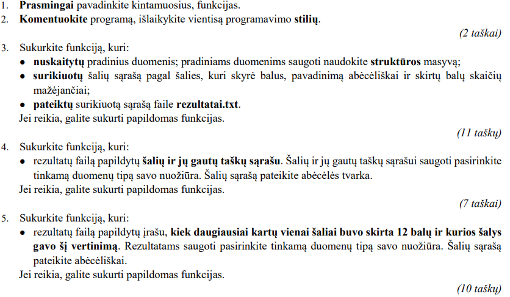
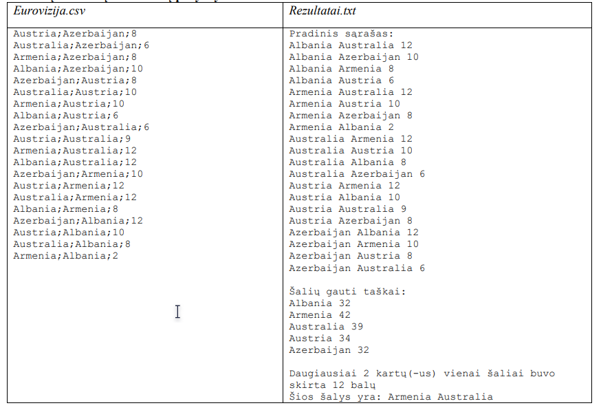
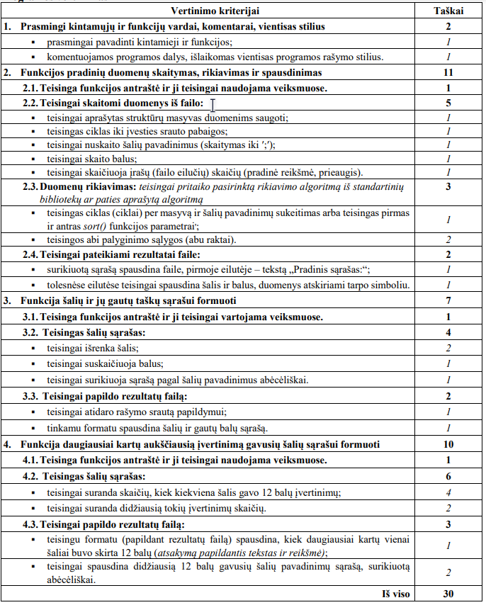

# Eurovizija

„Eurovizijos“ konkurse dainos vertinamos balais nuo 1 iki 12. Marija yra didelė „Eurovizijos“ gerbėja. Jai patinka
statistika ir ji kiekvienais metais užsirašo, kiek balų šalys suteikė (skyrė) konkurso dalyvėms. Marijai reikia
programos, kuri analizuotų vienų metų konkurso duomenis:
- suskaičiuotų, kiek taškų konkurse surinko kiekviena šalis;
- rastų didžiausią skaičių 12-ka balų duotą vienai šaliai;
- atspausdintų didžiausią 12-ka balų gavusių šalių pavadinimų sąrašą, surikiuotą abėcėliškai.

## Pradiniai duomenys
Pradiniai duomenys saugomi duomenų faile Eurovizija.csv. Faile yra ne daugiau kaip 2500 eilučių. Vienoje
eilutėje duota informacija apie šalių porą:
- šalies, suteikusios balus, pavadinimas anglų kalba;
- šalies, gavusios balus, pavadinimas anglų kalba;
- duotų balų skaičius (sveikasis skaičius nuo 1 iki 12).
Duomenys atskirti kabliataškiais.
Pvz., Informacija, kad Malta skyrė Armėnijai 12 balų, užrašoma tokia eilute:
``Malta;Armenia;12``

## Nurodymai ir vertinimas

## Rezultatai

Rezultatus pateikite tekstiniame faile Rezultatai.txt.
- Pirmoje eilutėje turi būti pateiktas tekstas „Pradinis sąrašas:“
- Tolesnėse eilutėse turi būti pateiktas surikiuotas pradinis sąrašas. Vienoje eilutėje pateikite informaciją apie
  šalių porą: šalies, skyrusios balus, pavadinimą; šalies, gavusios balus, pavadinimą ir šaliai skirtas balų
  skaičius.
- Palikite vieną tuščią eilutę.
- Naujoje eilutėje turi būti pateiktas tekstas „Šalių gauti balai:“
- Tolesnėse eilutėse turi būti pateiktas surikiuotas šalių ir jų gautų balų sąrašas. Vienoje eilutėje pateikite šalies
  pavadinimą ir gautų balų skaičių.
- Palikite vieną tuščią eilutę.
- Naujoje eilutėje turi būti pateiktas tekstas „Daugiausiai x kartų(-us) vienai šaliai buvo
  skirta 12 balų“; čia x – skaitinė reikšmė.
- Paskutinėje eilutėje turi būti pateiktas tekstas „Šios šalys yra: “; toliau toje pačioje eilutėje
  spausdinkite didžiausią 12-os balų skaičių gavusių šalių pavadinimų sąrašą, surikiuotą abėcėliškai. Šalių
  pavadinimus atskirkite vienu tarpu.

## Pradinių duomenų ir rezultatų pavyzdys

## Programos vertinimas

