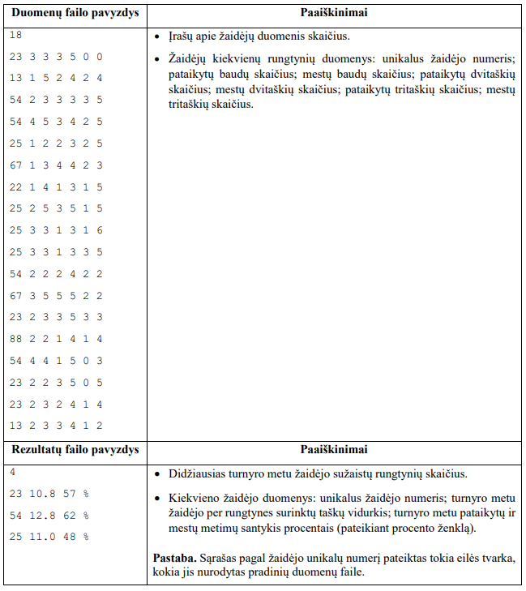

# Krepsinis

Mokykla Vasario 16-osios proga surengė mokinių „3 prieš 3“ krepšinio turnyrą. Pagal sutartas taisykles
pataikyti metimai buvo vertinami taškais: baudos metimas – 1 taškas, dvitaškis – 2 taškai ir tritaškis –
3 taškai. Nepataikytas metimas vertinamas 0 taškų. Kiekvienų rungtynių metu buvo fiksuojami žaidėjų
pataikytų ir mestų metimų duomenys.

Parašykite programą, kuri pateiktų turnyro metu didžiausią rungtynių skaičių sužaidusių žaidėjų sąrašą.
Šiame sąraše turi būti nurodytas turnyro metu žaidėjo per rungtynes surinktų taškų vidurkis ir pataikytų bei
mestų metimų santykis procentais.

## Pradiniai duomenys
Duomenys pateikti tekstiniame faile U1.txt.
- Pirmoje eilutėje pateiktas įrašų apie žaidėjų duomenis skaičius n (15 ≤ n ≤ 100).
- Tolesnėse n eilučių pateikti krepšinio turnyre dalyvavusių žaidėjų kiekvienų rungtynių duomenys:
unikalus žaidėjo numeris; pataikytų baudų skaičius; mestų baudų skaičius; pataikytų dvitaškių
skaičius; mestų dvitaškių skaičius; pataikytų tritaškių skaičius; mestų tritaškių skaičius. Duomenys
atskirti vienu tarpo simboliu.

## Rezultatai
Rezultatus pateikite tekstiniame faile U1rez.txt.
- Pirmoje eilutėje pateiktas didžiausias turnyro metu žaidėjo sužaistų rungtynių skaičius.
- Nuo antros eilutės pateikiamas didžiausią rungtynių skaičių sužaidusių žaidėjų sąrašas. Šiame sąraše
turi būti nurodyti kiekvieno žaidėjo duomenys: unikalus žaidėjo numeris; turnyro metu žaidėjo per
rungtynes surinktų taškų vidurkis, suapvalintas iki dešimtųjų; turnyro metu pataikytų ir mestų
metimų santykis procentais, suapvalintas iki artimiausio sveikojo skaičiaus. Duomenys atskirti
vienu tarpo simboliu, procento ženklas nuo skaičiaus taip pat atskirtas vienu tarpo simboliu. Jeigu
yra keli žaidėjai, sužaidę po vienodą didžiausią rungtynių skaičių, tuomet kiekvieno žaidėjo
duomenys pateikiami atskiroje eilutėje. Sąrašas pagal žaidėjo unikalų numerį pateikiamas tokia eilės
tvarka, kokia jis buvo pateiktas pradinių duomenų faile.

## Nurodymai
Sukurkite funkciją, kuri apskaičiuoja turnyro metu žaidėjo sužaistų rungtynių skaičių, per
rungtynes surinktų taškų vidurkį ir pataikytų bei mestų metimų santykį procentais.

## Duomenų ir rezultatų pavyzdys

