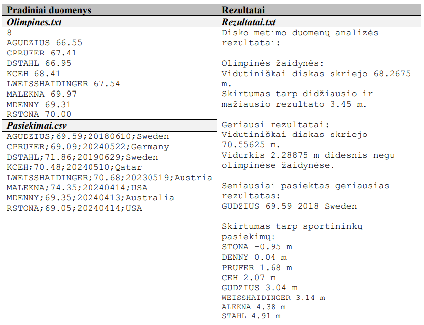

# Disko metimas

Tautvydui patinka sporto šaka – disko metimas. Jis gavo du duomenų failus (Olimpines.txt ir
Pasiekimai.csv), kuriuose pateikiami šios sporto šakos rezultatai. Gautus duomenis Tautvydas planuoja
išanalizuoti. Parašykite programą, kuri padėtų atsakyti į tokius klausimus apie pateiktus duomenis:

- Kokį vidutinį atstumą skrieja sportininkų metamas diskas olimpinėse žaidynėse?
- Koks skirtumas tarp didžiausio ir mažiausio pasiekto rezultato olimpinėse žaidynėse?
- Kokį vidutinį atstumą skrieja sportininkų metamas diskas, vertinant jų geriausius karjeros
rezultatus iki olimpinių žaidynių?
- Kuris vidurkis (olimpinių ar geriausių pasiekimų) yra didesnis ir kiek didesnis?
- Kurio sportininko geriausias rezultatas pasiektas seniausiai, kuriais metais ir kurioje šalyje?
- Koks sportininkų geriausių pasiekimų rezultatų, palyginti su olimpinių žaidynių rezultatais,
skirtumas?

## Pradiniai Duomenys

Faile Olimpines.txt pateikiami 2024 metų Paryžiaus olimpinių
žaidynių disko metikų rezultatai. Pirmas skaičius dokumente
nurodo, kelių sportininkų rezultatai pateikiami (iš viso dalyvavo
32 sportininkai). Kitose eilutėse pirmas elementas sportininko
kodas, sudarytas iš pirmos vardo raidės ir pavardės, antras
elementas – olimpinėse žaidynėse pasiektas rezultatas metrais.

Faile Pasiekimai.csv pateikiami tų pačių
sportininkų, kurie yra įrašyti faile Olimpines.txt,
geriausi karjeros rezultatai (pasiekti iki olimpinių
žaidynių). Pirmas elementas eilutėje – sportininko
kodas, sudarytas iš pirmos vardo raidės ir
pavardės, antras elementas – geriausias karjeros
rezultatas metrais, trečias elementas – natūralusis
skaičius, kuris koduoja datą, kada pasiektas
rezultatas (pirmi keturi skaitmenys – metai, kiti
du – mėnuo, paskutiniai du – diena), paskutinis
elementas – valstybė, kurioje pasiektas rezultatas
(anglų k.).

## Nurodymai ir vertinimas

1. Prasmingai pavadinkite programoje naudojamus kintamuosius ir funkcijas.
   (1 taškas)
2. Išlaikykite programoje vientisą stilių, komentuokite programos logines dalis.
   (1 taškas)
3. Nuskaitykite pradinius duomenis iš failų ir išsaugokite masyve (masyvuose), kurio (kurių)
   elemento tipas yra struktūra (klasė).
   (7 taškai)
4. Sukurkite funkciją (paprogramę) skirtumui tarp didžiausio ir mažiausio rezultato (pasiekto
   olimpinėse žaidynėse) apskaičiuoti ir įrašyti į failą Rezultatai.txt.
   (3 taškai)
5. Sukurkite funkciją (paprogramę) vidurkiui skaičiuoti ir gautam rezultatui įrašyti į failą
   Rezultatai.txt. Rezultato apvalinti nereikia. Funkcija (paprogramė) turi būti naudojama
   pagal pateiktus nurodymus (užduoties klausimus ir programos rezultatų pateikimą).
   (5 taškai)
6. Sukurkite funkciją (paprogramę), kuri pagal sportininko kodą atskirtų jo pavardę ir grąžintų
   kaip rezultatą.
   (2 taškai)
7. Sukurkite funkciją (paprogramę), kuri pagal datą atskirtų metus ir grąžintų kaip rezultatą.
   (2 taškai)
8. Sukurkite funkciją (paprogramę), kuri rastų pagal metus anksčiausiai savo geriausią rezultatą
   pasiekusį sportininką ir įrašytų į failą Rezultatai.txt jo pavardę, rezultatą, metus ir šalį.
   Kurdami ją panaudokite anksčiau sukurtas sportininko pavardės atskyrimo funkciją
   (paprogramę) ir metų pagal datą atskyrimo funkciją (paprogramę).
   (4 taškai)
9. Sukurkite funkciją (paprogramę), kuri rastų skirtumą tarp sportininko geriausių pasiekimų ir
   olimpinių žaidynių rezultatų, surikiuotų sportininkus pagal gautą rezultatų skirtumą nuo
   mažiausio iki didžiausio ir įrašytų į failą Rezultatai.txt sportininko pavardę, rezultatų
   skirtumą ir matavimo vienetą (m). Skirtumas imamas, iš geriausių pasiekimų rezultatų
   atimant olimpinių žaidynių rezultatą. Jei gaunamas neigiamas rezultatas, toks ir rašomas, ir
   atitinkamai pagal tai sportininkai rikiuojami.
   (5 taškai)
10. Pagal rezultatų įrašymo į failą Rezultatai.txt nurodymus teisingai įrašykite nurodytą
    informaciją ir gautus rezultatus.
    (2 taškai)

## Rezultatai

Programos rezultatus pateikite tekstiniame faile Rezultatai.txt.

- Pirmoje eilutėje įrašykite tekstą: Disko metimo duomenų analizės rezultatai:
- Antrą eilutę palikite tuščią.
- Trečioje eilutėje įrašykite tekstą: Olimpinės žaidynės:
- Ketvirtoje eilutėje įrašykite tekstą: Vidutiniškai diskas skriejo, šalia įrašomas
apskaičiuotas rezultatas, tada matavimo vienetų trumpinys m, gale taškas.
- Penktoje eilutėje įrašykite tekstą: Skirtumas tarp didžiausio ir mažiausio
rezultato, šalia įrašomas apskaičiuotas rezultatas, tada matavimo vienetų trumpinys m, gale
taškas.
- Šeštą eilutę palikite tuščią.
- Septintoje eilutėje įrašykite tekstą: Geriausi rezultatai:
- Aštuntoje eilutėje įrašykite tekstą: Vidutiniškai diskas skriejo, šalia įrašomas
apskaičiuotas rezultatas, tada matavimo vienetų trumpinys m, gale taškas.
- Devintoje eilutėje įrašykite tekstą: Vidurkis, šalia įrašomas apskaičiuotas rezultatas m, rezultato
palyginimas (didesnis / mažesnis) negu olimpinėse žaidynėse.
- Dešimtą eilutę palikite tuščią.
- Vienuoliktoje eilutėje įrašykite tekstą: Seniausiai pasiektas geriausias rezultatas:
- Dvyliktoje eilutėje – atitinkamos funkcijos (paprogramės) rezultatas.
- Tryliktą eilutę palikite tuščią.
- Keturioliktoje eilutėje įrašykite tekstą: Skirtumas tarp sportininkų pasiekimų:
- Tolesnėse eilutėse – atitinkamos funkcijos (paprogramės) rezultatas.

